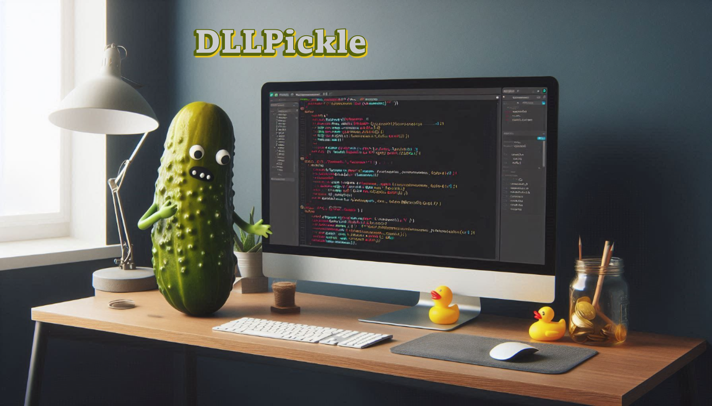

# DLL Pickle

A PowerShell module that helps you get un-stuck from dependency version conflicts (aka DLL pickle) that often occur when trying to connect to multiple Microsoft services.

<!-- badges-start -->

<!-- badges-end -->

## Example

Several Microsoft modules include the file **Microsoft.Identity.Client.dll** as a built-in dependency. The latest version of that file (<!--Version-->4.79.0<!--/Version-->) is actively maintained in the **AzureAD/microsoft-authentication-library-for-dotnet** repository. However, the following modules all update this package on different schedules, resulting in version conflicts that break authentication flows whenever you try to use multiple modules in one session:

- Az.Accounts
- ExchangeOnlineManagement
- Microsoft.Graph.Authentication
- MicrosoftTeams

