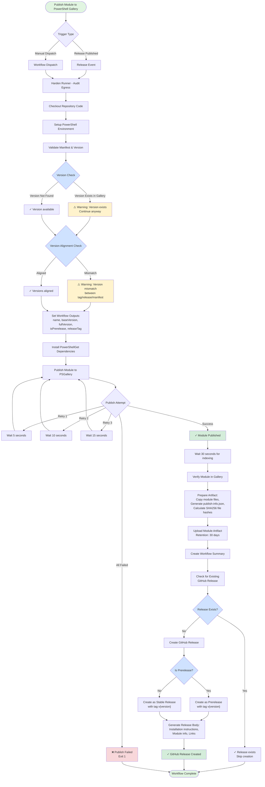

# Publishing DLLPickle to PowerShell Gallery

This document describes how to publish the DLLPickle module to the PowerShell Gallery using the automated GitHub Actions workflow.

## Prerequisites

Before the workflow can publish to PowerShell Gallery, you need to:

1. **Create a PowerShell Gallery API Key**
   - Go to [PowerShell Gallery](https://www.powershellgallery.com/)
   - Sign in with your Microsoft account
   - Navigate to your account settings
   - Create a new API key with the following permissions:
     - Push new packages and package versions
     - Push only specific packages (recommended): Select "DLLPickle"
   - Copy the API key (you won't be able to see it again)

2. **Add the API Key to GitHub Secrets**
   - Go to your repository on GitHub
   - Navigate to Settings → Secrets and variables → Actions
   - Click "New repository secret"
   - Name: `PSGALLERY_API_KEY`
   - Value: Paste your PowerShell Gallery API key
   - Click "Add secret"

3. **Configure the PSGallery Environment (Recommended)**
   - Go to Settings → Environments
   - Create a new environment named `psgallery`
   - Optionally add protection rules:
     - Required reviewers (recommended for production releases)
     - Deployment branches (e.g., only allow `main` branch)

## Publishing Process

### Automatic Publishing

The workflow automatically triggers when you create a new GitHub Release:

1. **Create a Git Tag**
   ```bash
   git tag -a v0.1.5 -m "Release version 0.1.5"
   git push origin v0.1.5
   ```

2. **Create a GitHub Release**
   - Go to your repository on GitHub
   - Click "Releases" → "Create a new release"
   - Select the tag you just created (e.g., `v0.1.5`)
   - Fill in the release title and description
   - Click "Publish release"

3. **Monitor the Workflow**
   - The workflow will automatically start
   - Go to Actions → "Publish to PowerShell Gallery"
   - Monitor the progress and check for any errors

### Manual Publishing (Dry-Run Testing)

You can manually trigger the workflow to test without actually publishing:

1. Go to Actions → "Publish to PowerShell Gallery"
2. Click "Run workflow"
3. Select the branch
4. Check "Run in dry-run mode" to test without publishing
5. Click "Run workflow"

This will validate the module and show what would be published without actually sending it to PowerShell Gallery.

## Workflow Features

- **Automatic Validation**: Tests the module manifest before publishing
- **Security Hardening**: Uses step-security/harden-runner
- **Dry-Run Mode**: Test the workflow without actually publishing
- **Verification**: Checks that the module appears in PowerShell Gallery after publishing
- **Environment Protection**: Uses GitHub Environments for additional security
- **Detailed Logging**: Provides clear output about the publishing process

## Version Management

The module version is defined in `DLLPickle/DLLPickle.psd1`:

```powershell
ModuleVersion = '0.1.4'
```

### Prerelease Versions

If the manifest includes a `Prerelease` tag:

```powershell
PrivateData = @{
    PSData = @{
        Prerelease = 'preview'
    }
}
```

The published version will be: `0.1.4-preview`

### Stable Releases

For stable releases, remove or comment out the `Prerelease` line in the manifest before creating the release.

## Troubleshooting

### Module Not Found After Publishing

PowerShell Gallery can take a few minutes to index new modules. The workflow waits up to 75 seconds and retries multiple times. If it still fails:

1. Check manually at: https://www.powershellgallery.com/packages/DLLPickle
2. Wait a few more minutes and try: `Find-Module -Name DLLPickle`

### Authentication Errors

If you see authentication errors:

1. Verify the `PSGALLERY_API_KEY` secret is set correctly
2. Check that the API key hasn't expired
3. Ensure the API key has permission to publish DLLPickle

### Version Conflicts

If the workflow fails with a version conflict:

1. Ensure the version in `DLLPickle.psd1` is higher than the published version
2. Check PowerShell Gallery to see what version is currently published
3. Update the `ModuleVersion` in the manifest and try again

## Security Considerations

- The API key is stored securely in GitHub Secrets and never exposed in logs
- The workflow uses pinned action versions for security
- Harden-runner audits all network calls during execution
- Environment protection can require manual approval before publishing

## Related Documentation

- [PowerShell Gallery Publishing Guide](https://docs.microsoft.com/powershell/scripting/gallery/how-to/publishing-packages/publishing-a-package)
- [GitHub Actions Secrets](https://docs.github.com/actions/security-guides/encrypted-secrets)
- [Creating GitHub Releases](https://docs.github.com/repositories/releasing-projects-on-github/managing-releases-in-a-repository)


