# 🎯 Unified Release Workflow

## Overview

The **unified release workflow** (`release.yml`) consolidates three competing release workflows into a single, coherent system that handles **all release scenarios** from a single source of truth.

### What It Replaces

- ❌ `2 - Release.yml` (dependency-triggered releases) → **CONSOLIDATED**
- ❌ `3 - Create Release.yml` (code commit releases) → **CONSOLIDATED**  
- ❌ `4 - Publish Module.yml` (standalone publish) → **CONSOLIDATED**

### What It Retains

- ✅ `1 - Update Dependencies.yml` (checks for updates, creates PRs) → **UNCHANGED** - This workflow still exists to create dependency update PRs. When merged to main, it triggers the new unified release workflow.

---

## Architecture

### Trigger Events

The unified workflow is triggered in these scenarios:

#### 1. **Code Commit Trigger** (Push to main)

```yaml
on:
  push:
    branches: [main]
    paths:
      - 'src/DLLPickle/**'  # Only release if module code changes
      - '!**.md'             # Ignore documentation changes
```

**Version Bump Logic:** Automatic analysis of conventional commits since last release tag

- `BREAKING:` → Major bump (e.g., 1.0.0 → 2.0.0)
- `feat:` → Minor bump (e.g., 1.0.0 → 1.1.0)
- `fix:`, `chore:`, etc. → Patch bump (e.g., 1.0.0 → 1.0.1)

**Approval:** No additional approval needed (code review via PR)

#### 2. **Dependency Update Trigger** (Dependency workflow merges PR to main)

When `1 - Update Dependencies.yml` auto-merges a PR with package updates, the commit push triggers this workflow via path-based activation.

**Version Bump Logic:** Either:

- Conventional commits if there are other code commits in the push
- Patch bump if only the dependency commit is new (default behavior)

**Approval:** No additional approval needed (dependencies were pre-approved)

#### 3. **Manual Dispatch Trigger** (Explicit release request)

```yaml
workflow_dispatch:
  inputs:
    version_bump:
      description: 'Version bump type (major, minor, patch) - overrides conventional commit analysis'
      required: false
      type: choice
      options: [auto, major, minor, patch]
```

**Usage:** Go to **Actions → Release and Publish → Run workflow** and select bump type

**Version Bump Logic:**

- `auto` → Uses conventional commit analysis (like code trigger)
- `major`, `minor`, `patch` → Uses explicitly specified bump

**Approval:** Requires approval if in psgallery environment (see below)

---

## Workflow Jobs (Sequential)

The workflow is organized into 6 sequential jobs, each with clear responsibility:

### 1. **analyze**

**Purpose:** Determine if a release is needed and what version to release

**Triggers:**

- Skips if commit contains `[skip-release]` or `[no-release]`
- Always runs for code commits and manual dispatch

**Outputs:**

- `should_release` - Boolean: whether to proceed with release
- `version_bump` - String: `major`, `minor`, or `patch`
- `current_version` - String: e.g., "1.2.3"
- `new_version` - String: e.g., "1.2.4"
- `trigger_source` - String: `push`, `manual`, or `dependency`

**Uses Helper Script:**

- **`Get-VersionBump.ps1`** - Analyzes git commit history since last tag
  - Parses conventional commit messages
  - Returns semantic version bump recommendation
  - Returns `false` if no release-worthy commits found

**Key Logic:**

```powershell
# For push/code triggers: Analyze commits
$versionResult = & .\.github\scripts\Get-VersionBump.ps1

# For manual dispatch: Use input or analyze commits
if ($triggerSource -eq "manual" -and $versionBump -ne "auto") {
    # Use explicit bump from input
} else {
    # Use semantic analysis from commits
}
```

---

### 2. **update-version**

**Depends on:** `analyze` (only runs if `should_release == true`)

**Purpose:** Update the PowerShell module manifest with the new version and create a git commit + tag

**Steps:**

1. Calls **`Update-ModuleVersion.ps1`** to bump version in `DLLPickle.psd1`
   - Updates `ModuleVersion` field
   - Validates change was applied
   - Returns success/error status

2. Commits the version change to `main`

   ```powershell
   git commit -m "chore(release): bump version to X.Y.Z"
   ```

3. Creates an annotated git tag

   ```powershell
   git tag -a vX.Y.Z -m "Release X.Y.Z"
   git push origin vX.Y.Z
   ```

**Why This Order:**

- Updates manifest BEFORE building ensures build picks up new version
- Creates tag BEFORE release ensures GitHub knows which commit to release
- All done on main branch so dependencies resolve correctly

---

### 3. **build-and-test**

**Depends on:** `update-version`

**Purpose:** Build the module and run all tests to validate the release

**Steps:**

1. Checkout updated repository (includes new tag)
2. Build module using `Invoke-Build`
3. Run all unit and integration tests
4. Upload build artifacts if tests pass

**Why This Order:**

- Ensures version is already bumped in manifest
- Ensures tests run against actual release version
- Prevents publishing if tests fail

**If Tests Fail:**

- Job fails
- GitHub release is NOT created
- Version was already bumped and tagged (manual cleanup needed)

---

### 4. **create-release**

**Depends on:** `build-and-test`

**Purpose:** Create a GitHub release with generated release notes

**Checks:**

1. Verifies release doesn't already exist for this version
2. Generates release notes from git history
3. Creates release with notes

**Release Notes Include:**

- Version number
- Version bump type (major/minor/patch)
- Trigger source (push/manual/dependency)
- Recent commit messages
- Links to Gallery and GitHub release page

**Why This Order:**

- Ensures build is successful before creating release
- Release marks the "official" release point for users

---

### 5. **publish**

**Depends on:** `create-release`

**Approval Gate:**

- Uses GitHub `environment: psgallery` with required reviewers
- Configure in repository settings: **Settings → Environments → psgallery → Required reviewers**
- Prevents accidental publishes to live gallery

**Purpose:** Publish the module to PowerShell Gallery

**Checks:**

1. Verifies manifest version matches expected version
2. Checks if version already published (idempotency)
3. Calls **`Publish-ToGallery.ps1`** with retry logic
   - Attempts up to 3 times with exponential backoff
   - Waits for indexing (30 seconds default)
   - Verifies publish via `Find-Module`

**Requires Secret:**

- `PSGALLERY_API_KEY` - PowerShell Gallery API token
- Store in repository secrets: **Settings → Secrets and variables → Actions**

**Why This Order:**

- Ensures everything is tested and released before publishing
- Uses approval gate to prevent accidents
- Uses retry logic to handle transient API issues

---

### 6. **summary**

**Depends on:** All previous jobs (runs even if previous jobs fail)

**Purpose:** Generate workflow summary with status and links

**Output:**

- Displays in workflow run summary
- Shows final status of all jobs
- Provides links to release, gallery, and workflow run

---

## Decision Tree

This diagram shows how the workflow determines whether to release and what version to bump:

```text
┌─ Push to main (with code changes)
│  ├─ Analyze commits since last tag
│  ├─ If conventional commits found → Determine bump (major/minor/patch)
│  └─ Release with semantic version
│
├─ Dependency workflow merges PR to main
│  ├─ Push event triggers workflow
│  ├─ Analyze commits (likely just dep update commit)
│  ├─ Likely patch bump (or based on actual commits)
│  └─ Release with bump version
│
└─ Manual dispatch with version_bump
   ├─ If "auto" → Analyze commits (same as push)
   ├─ If "major/minor/patch" → Use explicit bump
   └─ Release with specified version
```

---

## Configuration

### Repository Secrets

**Required:**

```shell
PSGALLERY_API_KEY=<your-powershell-gallery-api-token>
```

Get this from PowerShell Gallery account settings:
<https://www.powershellgallery.com/account/apikeys>

### Environment Approval Gate

Configure approval for PSGallery publishes:

1. Go to **Settings → Environments**
2. Click **New environment** → Name it `psgallery`
3. Check **Required reviewers**
4. Add team members who can approve releases

### Path-Based Triggering

The workflow only triggers on changes to specific paths:

- ✅ Changes in `src/DLLPickle/` → TRIGGER
- ❌ Changes only in docs → SKIP
- ❌ Changes only in markdown → SKIP

This prevents unnecessary releases for documentation changes.

---

## Usage Examples

### 1. **Automatic Release (Code Commit)**

```bash
# 1. Create a feature branch
git checkout -b feat/new-feature

# 2. Make code changes
echo "New feature code" >> src/DLLPickle/Public/Get-Example.ps1

# 3. Commit with conventional message
git commit -m "feat: add new Get-Example function"

# 4. Create PR, get review, merge to main
git push origin feat/new-feature
# ... Create PR and merge ...

# Result: Workflow triggers automatically
# - Analyzes commit: "feat: add..." → minor bump
# - Updates version: 1.0.0 → 1.1.0
# - Builds and tests
# - Creates release v1.1.0
# - Publishes to gallery (after approval)
```

### 2. **Dependency Update Release**

```bash
# 1. Dependency workflow runs on schedule (2 AM UTC daily)
# 2. Finds updates to packages in Packages.json
# 3. Creates/updates PR with updates
# 4. Auto-merges PR when checks pass

# Result: Commit push to main triggers release workflow
# - Detects commit from dependency update
# - Patches version (e.g., 1.1.0 → 1.1.1)
# - Builds and tests
# - Creates release v1.1.1
# - Publishes to gallery
```

### 3. **Manual Release (Emergency Hotfix)**

```bash
# 1. Go to GitHub repository
# 2. Actions → Release and Publish → Run workflow
# 3. Select version_bump: "patch"
# 4. Click "Run workflow"

# Result: Workflow runs immediately
# - Uses explicit patch bump
# - Updated version: 1.1.1 → 1.1.2
# - Builds and tests
# - Creates release v1.1.2
# - Publishes to gallery (after approval)
```

### 4. **Skip Release on Specific Commit**

```bash
# Skip release for this commit
git commit -m "chore: update readme [skip-release]"

# Or
git commit -m "docs: update docs [no-release]"

# Result: Workflow runs but analyze job exits early
# - No release created
# - Useful for documentation-only or chore commits
```

---

## Failure Scenarios

### If Build Fails

**What happens:**

- `build-and-test` job fails
- `create-release` and `publish` jobs are skipped
- Version was already bumped and tagged (on main branch)

**Recovery:**

1. Fix the issue locally
2. Create new PR with fix
3. Merge to main
4. New release will be created for the fix commit

**Note:** Manual cleanup may be needed if the failed version tag should be removed

### If Publish Fails

**What happens:**

- `publish` job fails (usually after 3 retry attempts)
- GitHub release exists but module not in gallery
- Version tag exists on main

**Recovery:**

1. Fix the underlying issue (e.g., API key, network)
2. Either:
   - Manually run `Publish-ToGallery.ps1` locally, OR
   - Manually trigger workflow with `workflow_dispatch` and "auto" option

### If Approval Gate Times Out

**What happens:**

- `publish` job waits for approval
- If approval not provided within environment timeout (GitHub default: unlimited)
- Job stays pending

**Recovery:**

1. Visit workflow run page
2. Click "Review deployments"
3. Select "Approve" or "Reject"

---

## Removing Old Workflows

Once the unified workflow is tested and validated, remove these legacy workflows:

1. **Delete `.github/workflows/2 - Release.yml`**

   ```bash
   git rm '.github/workflows/2 - Release.yml'
   git commit -m "chore: remove legacy release workflow (consolidated to release.yml)"
   ```

2. **Delete `.github/workflows/4 - Publish Module.yml`**

   ```bash
   git rm '.github/workflows/4 - Publish Module.yml'
   git commit -m "chore: remove legacy publish workflow (consolidated to release.yml)"
   ```

3. **Keep `.github/workflows/1 - Update Dependencies.yml`**
   - This still creates dependency update PRs
   - They merge to main, which triggers the unified release workflow

**Do NOT delete until:**

- ✅ Unified workflow has been tested with at least one successful release
- ✅ Both code commit and dependency update pathways have been validated
- ✅ All team members understand the new system

---

## Helper Scripts Used

The unified workflow calls these PowerShell helper scripts (created in Phase 2):

| Script | Purpose | Called By |
| ------ | ------- | --------- |
| `Get-VersionBump.ps1` | Analyze commits, determine version bump | `analyze` job |
| `Update-ModuleVersion.ps1` | Update .psd1 manifest version | `update-version` job |
| `Publish-ToGallery.ps1` | Publish to gallery with retry logic | `publish` job |

See `.github/scripts/README.md` for detailed documentation on each script.

---

## Environment Variables

Key environment variables used:

```powershell
MODULE_NAME = "DLLPickle"
MODULE_DIR = "./src/DLLPickle"
MANIFEST_PATH = "./src/DLLPickle/DLLPickle.psd1"
```

These are set at the workflow level and available to all jobs.

---

## Monitoring

### Check Release Status

1. Go to GitHub repository → **Actions**
2. Click **Release and Publish** workflow
3. View recent runs
4. Click a run to see detailed job status

### Enable Notifications

1. Go to **GitHub Settings → Notifications**
2. Configure email/web notifications for workflow completions

### Check Gallery Listing

After publish completes, verify module is on PSGallery:

```bash
Find-Module -Name DLLPickle -Repository PSGallery | Select-Object Version, PublishedDate
```

---

## Troubleshooting

### "Version already published" Error

**Problem:** Workflow tries to publish version that already exists on gallery

**Solution:** Manual override in `publish` job check - modify `already_published` condition or increment version and re-run

### "Approval gate timeout"

**Problem:** `publish` job waits forever for approval that never comes

**Solution:**

1. Visit workflow run page
2. Click "Review deployments" button
3. Approve or reject the deployment

### "Tag already exists"

**Problem:** Git tag for release version already exists

**Solution:** Manual cleanup - delete old tag with `git tag -d vX.Y.Z && git push origin :refs/tags/vX.Y.Z`

### "Manifest version doesn't match"

**Problem:** Published module version doesn't match expected version

**Solution:** Check manifest file directly - run `Update-ModuleVersion.ps1` locally to verify

---

## Next Steps

1. ✅ **Review this unified workflow** - Understand how it works
2. 📝 **Test with a code commit** - Make a small code change, merge to main, verify release is created
3. 📝 **Test with dependency update** - Wait for dependency workflow or manually trigger, verify release
4. 📝 **Configure approvals** - Set up `psgallery` environment with required reviewers
5. 🗑️ **Remove legacy workflows** - Delete `2 - Release.yml` and `4 - Publish Module.yml` after validation
6. 📚 **Update documentation** - Update team wiki/docs to reference new unified workflow

```mermaid
flowchart TD
    Start([Publish Module to PowerShell Gallery]) --> Trigger{Trigger Type}

    Trigger -->|Release Published| TriggerA[Release Event]
    Trigger -->|Manual Dispatch| TriggerB[Workflow Dispatch]

    TriggerA --> Harden[Harden Runner - Audit Egress]
    TriggerB --> Harden

    Harden --> Checkout[Checkout Repository Code]
    Checkout --> Setup[Setup PowerShell Environment]
    Setup --> Validate[Validate Manifest & Version]

    Validate --> CheckVersion{Version Check}
    CheckVersion -->|Version Exists in Gallery| WarnContinue["⚠️ Warning: Version exists<br/>Continue anyway"]
    CheckVersion -->|Version Not Found| ProceedOK["✓ Version available"]

    WarnContinue --> VersionAlign{Version Alignment Check}
    ProceedOK --> VersionAlign

    VersionAlign -->|Mismatch| WarnMismatch["⚠️ Warning: Version mismatch<br/>between tag/release/manifest"]
    VersionAlign -->|Aligned| VersionOK["✓ Versions aligned"]

    WarnMismatch --> SetOutputs[Set Workflow Outputs:<br/>name, baseVersion, fullVersion,<br/>isPrerelease, releaseTag]
    VersionOK --> SetOutputs

    SetOutputs --> InstallDeps[Install PowerShellGet Dependencies]
    InstallDeps --> Publish[Publish Module to PSGallery]

    Publish --> RetryLogic{Publish Attempt}
    RetryLogic -->|Retry 1| Wait1[Wait 5 seconds]
    RetryLogic -->|Retry 2| Wait2[Wait 10 seconds]
    RetryLogic -->|Retry 3| Wait3[Wait 15 seconds]

    Wait1 --> Publish
    Wait2 --> Publish
    Wait3 --> Publish

    RetryLogic -->|Success| PublishOK["✓ Module Published"]
    RetryLogic -->|All Failed| PublishFail["❌ Publish Failed<br/>Exit 1"]

    PublishOK --> Wait30[Wait 30 seconds for indexing]
    Wait30 --> VerifyPublish[Verify Module in Gallery]

    VerifyPublish --> ArtifactPrep[Prepare Artifact:<br/>Copy module files,<br/>Generate publish-info.json,<br/>Calculate SHA256 file hashes]

    ArtifactPrep --> UploadArtifact[Upload Module Artifact<br/>Retention: 30 days]
    UploadArtifact --> Summary[Create Workflow Summary]

    Summary --> CheckRelease[Check for Existing<br/>GitHub Release]

    CheckRelease --> ReleaseExists{Release Exists?}
    ReleaseExists -->|Yes| Skip["✓ Release exists<br/>Skip creation"]
    ReleaseExists -->|No| CreateRelease[Create GitHub Release]

    CreateRelease --> Prerelease{Is Prerelease?}
    Prerelease -->|Yes| CreatePre[Create as Prerelease<br/>with tag v&lcub;version&rcub;]
    Prerelease -->|No| CreateStable[Create as Stable Release<br/>with tag v&lcub;version&rcub;]

    CreatePre --> ReleaseBody[Generate Release Body:<br/>Installation instructions,<br/>Module info, Links]
    CreateStable --> ReleaseBody

    ReleaseBody --> ReleaseSuccess["✓ GitHub Release Created"]

    Skip --> End([Workflow Complete])
    ReleaseSuccess --> End
    PublishFail --> End

    style Start fill:#e1f5e1
    style End fill:#e1f5e1
    style PublishOK fill:#d4edda
    style ReleaseSuccess fill:#d4edda
    style PublishFail fill:#f8d7da
    style WarnContinue fill:#fff3cd
    style WarnMismatch fill:#fff3cd
    style Prerelease fill:#cfe2ff
    style CheckVersion fill:#cfe2ff
    style VersionAlign fill:#cfe2ff
    style ReleaseExists fill:#cfe2ff
```



## End

End of combined workflow documentation. This will be consolidated at some point!
