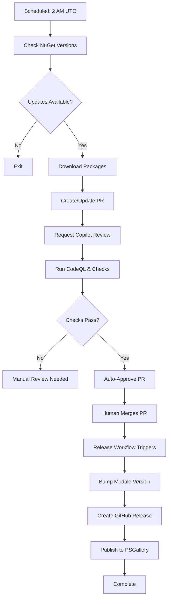

# GitHub Actions Workflow Architecture

## Overview

The DLLPickle repository uses a two-stage workflow architecture for automated dependency management:

1. **Update Dependencies** - Creates PRs with dependency updates
2. **Release and Publish** - Bumps version, creates releases, and publishes to PSGallery

## Workflow 1: Update Dependencies

**File**: `.github/workflows/1 - Update Dependencies.yml`

**Trigger**: Daily at 2 AM UTC (scheduled) or manual

**Purpose**: Automatically check for NuGet package updates and create PRs

### Process Flow

1. **Check for Updates** - Queries NuGet API for latest versions
2. **Download & Extract** - Downloads new packages if updates are available
3. **Create/Update Branch** - Creates or updates `chore/update-packages` branch
4. **Create/Update PR** - Opens PR with dependency changes
5. **Request Reviews** - Adds labels and requests Copilot review
6. **Wait for Checks** - Waits up to 30 minutes for CI checks
7. **Auto-Approve** - Approves PR automatically if all checks pass

### Key Features

- ✅ **Concurrency Control** - Prevents overlapping runs
- ✅ **Fork Safety** - Only runs on main repository
- ✅ **Idempotent** - Updates existing PRs instead of creating duplicates
- ✅ **Smart Waiting** - Waits for CodeQL and other checks
- ✅ **Auto-Approval** - Approves after successful checks

### Configuration

```yaml
# Required secrets:
# - PAT_CREATEPR: Personal Access Token with repo and PR permissions
```

## Workflow 2: Release and Publish

**File**: `.github/workflows/2 - Release.yml`

**Trigger**: PR merge to main with `dependencies` label, or manual

**Purpose**: Version bump, create GitHub releases, and publish to PSGallery

### Process Flow

1. **Determine Bump Type** - Patch (default), minor, or major
2. **Update Module Version** - Updates `DLLPickle.psd1`
3. **Extract Changes** - Captures PR summary for release notes
4. **Commit Version** - Commits version bump to main
5. **Create Release** - Creates tagged GitHub release
6. **Publish Module** - Publishes to PowerShell Gallery

### Key Features

- ✅ **Automatic Trigger** - Runs on dependency PR merge
- ✅ **Manual Trigger** - Can be run manually with version control
- ✅ **Smart Versioning** - Detects version bump type from PR
- ✅ **Rich Release Notes** - Auto-generates from PR content
- ✅ **PSGallery Publishing** - Automated module publication

### Configuration

```yaml
# Required secrets:
# - PSGALLERY_API_KEY: PowerShell Gallery API key
```

### Version Bump Logic

- **Patch** (default): Dependency updates
- **Minor**: Feature additions (detect via PR title keywords)
- **Major**: Breaking changes (detect via PR title keywords)
- **Manual**: Choose any bump type when manually triggered

## Complete Update Flow



## Safety Features

### Update Dependencies Workflow

- Only runs on `SamErde/DLLPickle` repository (not forks)
- Single concurrent run allowed (prevents conflicts)
- Won't approve if any checks fail
- 30-minute timeout for check completion
- Uses bot account for commits and PRs

### Release Workflow

- Only triggers on merged PRs with `dependencies` label
- Validates module manifest before publishing
- Creates git tags for version tracking
- Can be manually triggered for non-automated releases
- Fails fast if PSGallery publish errors occur

## Manual Operations

### Trigger Dependency Check

```bash
gh workflow run "Update Dependencies"
```

### Trigger Release (with version control)

```bash
# Patch release (0.0.X)
gh workflow run "Release and Publish" -f version_bump=patch

# Minor release (0.X.0)
gh workflow run "Release and Publish" -f version_bump=minor

# Major release (X.0.0)
gh workflow run "Release and Publish" -f version_bump=major
```

### Enable Auto-Merge (Optional)

To fully automate the process, enable auto-merge on the created PR:

```bash
gh pr merge <PR_NUMBER> --auto --squash
```

This allows PRs to merge automatically once approved and checks pass.

## Migration Notes

### Deprecated Workflows

- **`DEPRECATED - Update Monitored Packages.yml`** - Old workflow that directly committed to main. No longer used.

### Key Changes

1. **No Direct Commits** - All changes now go through PR review
2. **Separation of Concerns** - Updates vs. releases are separate
3. **Better Safety** - Checks required before approval
4. **Audit Trail** - All changes visible in PR history
5. **Flexibility** - Manual version control when needed

## Troubleshooting

### PR Not Auto-Approved

- Check that all required checks passed
- Verify PAT_CREATEPR has appropriate permissions
- Review workflow logs for timeout issues

### Release Not Triggered

- Ensure merged PR has `dependencies` label
- Verify PR was merged to `main` branch
- Check that PR merge event triggered workflow

### PSGallery Publish Failed

- Validate PSGALLERY_API_KEY is set correctly
- Ensure API key has publish permissions
- Check module manifest is valid (`Test-ModuleManifest`)

## Best Practices

1. **Review Auto-Approved PRs** - Even though automated, quick human review is good
2. **Monitor Release Workflow** - Ensure PSGallery publishes succeed
3. **Test Locally First** - Run `Invoke-Build` locally before merging
4. **Keep Secrets Fresh** - Rotate tokens periodically
5. **Update Documentation** - Keep this doc in sync with workflow changes

---

*Last updated: December 26, 2025*
