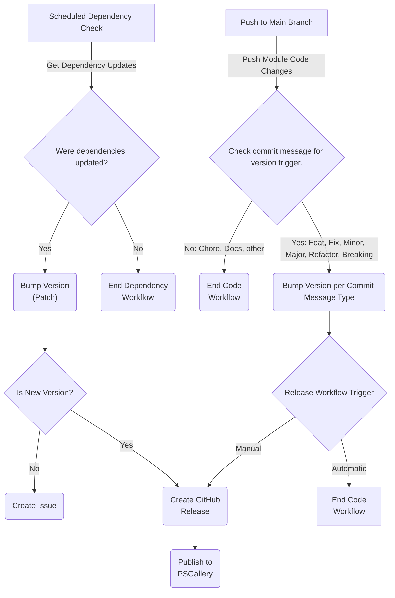
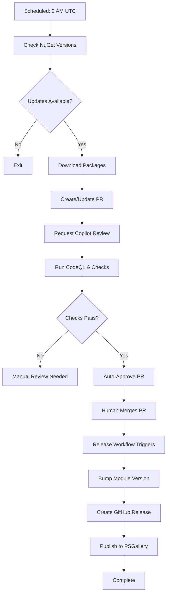

# GitHub Actions Workflow Architecture

## Overview

The DLLPickle repository uses a two-stage workflow architecture for automated dependency management:

1. **Update Dependencies** - Creates PRs with dependency updates
2. **Release and Publish** - Bumps version, creates releases, and publishes to PSGallery



## Workflow 1: Update Dependencies

**File**: `.github/workflows/Update Dependencies.yml`

**Trigger**: Daily at 2 AM UTC (scheduled) or manual

**Purpose**: Automatically check for NuGet package updates and create PRs

### Process Flow

1. **Check for Updates** - Queries NuGet API for latest versions
2. **Download & Extract** - Downloads new packages if updates are available
3. **Create/Update Branch** - Creates or updates `chore/update-packages` branch
4. **Create/Update PR** - Opens PR with dependency changes
5. **Request Reviews** - Adds labels and requests Copilot review
6. **Wait for Checks** - Waits up to 30 minutes for CI checks
7. **Auto-Approve** - Approves PR automatically if all checks pass

### Key Features

- ✅ **Concurrency Control** - Prevents overlapping runs
- ✅ **Fork Safety** - Only runs on main repository
- ✅ **Idempotent** - Updates existing PRs instead of creating duplicates
- ✅ **Smart Waiting** - Waits for CodeQL and other checks
- ✅ **Auto-Approval** - Approves after successful checks

## Workflow 2: Release and Publish

**File**: `.github/workflows/Release and Publish.yml`

**Trigger**: PR merge to main with `dependencies` label, or manual

**Purpose**: Version bump, create GitHub releases, and publish to PSGallery

### Process Flow (Update Dependencies)

1. **Determine Bump Type** - Patch (default), minor, or major
2. **Update Module Version** - Updates `DLLPickle.psd1`
3. **Extract Changes** - Captures PR summary for release notes
4. **Commit Version** - Commits version bump to main
5. **Create Release** - Creates tagged GitHub release
6. **Publish Module** - Publishes to PowerShell Gallery

### Key Features (Update Dependencies)

- ✅ **Automatic Trigger** - Runs on dependency PR merge
- ✅ **Manual Trigger** - Can be run manually with version control
- ✅ **Smart Versioning** - Detects version bump type from PR
- ✅ **Rich Release Notes** - Auto-generates from PR content
- ✅ **PSGallery Publishing** - Automated module publication

### Version Bump Logic

- **Patch** (default): Dependency updates
- **Minor**: Feature additions (detect via PR title keywords)
- **Major**: Breaking changes (detect via PR title keywords)
- **Manual**: Choose any bump type when manually triggered

## Complete Update Flow



## Safety Features

### Update Dependencies Workflow

- Only runs on `SamErde/DLLPickle` repository (not forks)
- Single concurrent run allowed (prevents conflicts)
- Won't approve if any checks fail
- 30-minute timeout for check completion
- Uses bot account for commits and PRs

### Release Workflow

- Only triggers on merged PRs with `dependencies` label
- Validates module manifest before publishing
- Creates git tags for version tracking
- Can be manually triggered for non-automated releases
- Fails fast if PSGallery publish errors occur

## Manual Operations

### Trigger Dependency Check

```bash
gh workflow run "Update Dependencies"
```

### Trigger Release (with version control)

```bash
# Patch release (0.0.X)
gh workflow run "Release and Publish" -f version_bump=patch

# Minor release (0.X.0)
gh workflow run "Release and Publish" -f version_bump=minor

# Major release (X.0.0)
gh workflow run "Release and Publish" -f version_bump=major
```

### Enable Auto-Merge

To fully automate the process, enable auto-merge on the created PR:

```bash
gh pr merge <PR_NUMBER> --auto --squash
```

This allows PRs to merge automatically once approved and checks pass.

## Troubleshooting

### PR Not Auto-Approved

- Check that all required checks passed
- Verify PAT_CREATEPR has appropriate permissions
- Review workflow logs for timeout issues

### Release Not Triggered

- Ensure merged PR has `dependencies` label
- Verify PR was merged to `main` branch
- Check that PR merge event triggered workflow

### PSGallery Publish Failed

- Validate PSGALLERY_API_KEY is set correctly
- Ensure API key has publish permissions
- Check module manifest is valid (`Test-ModuleManifest`)

---

## Detailed Workflow Diagrams

This project relies on several workflows to keep library dependencies updated automatically.

## Update Monitored Packages

```mermaid
flowchart

    Start([Update Monitored Packages]) --> LoopStart[Initialize Loop: process each tracked library in Packages.json]

    subgraph Left ["Check for Updates to Monitored Packages"]

        JSON["Sample entry in Packages.json:<br/><br/>{<br/>  name: Microsoft.Identity.Client.Broker,<br/>  version: 4.79.2<br/>}"]
        style JSON text-align: left
        JSON --> CompareVersion

        LoopStart[Initialize Loop: process each tracked library in Packages.json]
        LoopStart --> CheckPackage[Check NuGet.org for the latest package version]
        CheckPackage --> CompareVersion{Is JSON tracking the latest version number?}

        CompareVersion -->|No:<br />Current Entry < Latest Release | UpdateAvailable["Update Available<br/>Add to Summary"]
        CompareVersion -->|Yes:<br />Current Entry = Latest Release | UpToDate[✓ Already Up to Date]

        UpdateAvailable --> MarkUpdate[Set updates_available=true<br/>Append to update_summary]
        UpToDate --> NextPackage{More Packages?}
        MarkUpdate --> NextPackage

        NextPackage -->|Yes| CheckPackage
        NextPackage -->|No| AnyUpdates{Updates Available?}

    end

    subgraph Right ["Download Updates if Available"]

        AnyUpdates -->|No| EndNoUpdate["✓ All packages up to date<br/>Workflow Complete"]
        AnyUpdates -->|Yes| DownloadLoop

        DownloadLoop --> Download[Download .nupkg<br/>from NuGet.org]
        Download --> Extract[Extract nupkg<br/>as ZIP archive]

        Extract --> FindFramework[Search for DLLs in<br/>framework paths]

        FindFramework --> TryPaths{Try Framework Paths}
        TryPaths -->|netstandard2.0| PathFound1
        TryPaths -->|netstandard2.1| PathFound1
        TryPaths -->|net6.0| PathFound1
        TryPaths -->|net472| PathFound1
        TryPaths -->|runtimes/win paths| PathFound1

        PathFound1{DLLs Found?}
        PathFound1 -->|Yes| CopyDLLs[Copy DLLs to<br/>Assembly folder]
        PathFound1 -->|No| WarnNoDLL["⚠️ Warning: No compatible DLLs<br/>Continue to next"]

        CopyDLLs --> UpdateJSON[Update version in<br/>Packages.json]
        UpdateJSON --> MarkUpdated[Mark as updated]

        MarkUpdated --> MoreDownloads{More Packages?}
        WarnNoDLL --> MoreDownloads

        MoreDownloads -->|Yes| DownloadLoop
        MoreDownloads -->|No| SaveJSON[Save updated<br/>Packages.json]

    end

subgraph Finalization ["Finalize and Release"]

    SaveJSON --> ModuleManifest[Read Module Manifest]

    ModuleManifest --> IncrementVersion[Increment Patch Version<br/>x.y.z → x.y.z+1]
    IncrementVersion --> UpdateManifest[Update Module Manifest<br/>with new version]

    UpdateManifest --> GitConfig[Configure Git User:<br/>github-actions bot]

    GitConfig --> GitStage[Stage Changes:<br/>Assembly/*.dll<br/>Assembly/Packages.json<br/>DLLPickle.psd1]

    GitStage --> GitCommit[Commit Changes:<br/>Update MSAL packages:<br/>summary message]
    GitCommit --> GitPush[Push to Repository]

    GitPush --> CreateRelease[Create GitHub Release]
    CreateRelease --> ReleaseDetails[Set Release Details:<br/>Tag: v&lcub;new_version&rcub;<br/>Title: Release v&lcub;new_version&rcub;<br/>Body: Package update summary]

    ReleaseDetails --> PublishRelease[Publish Release:<br/>Not draft, Not prerelease]

    PublishRelease --> ReleaseSuccess["✓ GitHub Release Created"]

    end
```

```mermaid
flowchart

    Start([Update Monitored Packages]) --> LoopStart[Initialize Loop: process each tracked library in Packages.json]

    subgraph Left ["Check for Updates to Monitored Packages"]

        JSON["Sample entry in Packages.json:<br/><br/>{<br/>  name: Microsoft.Identity.Client.Broker,<br/>  version: 4.79.2<br/>}"]
        style JSON text-align: left
        JSON --> CompareVersion

        LoopStart[Initialize Loop: process each tracked library in Packages.json]
        LoopStart --> CheckPackage[Check NuGet.org for the latest package version]
        CheckPackage --> CompareVersion{Is JSON tracking the latest version number?}

        CompareVersion -->|No:<br />Current Entry < Latest Release | UpdateAvailable["Update Available<br/>Add to Summary"]
        CompareVersion -->|Yes:<br />Current Entry = Latest Release | UpToDate[✓ Already Up to Date]

        UpdateAvailable --> MarkUpdate[Set updates_available=true<br/>Append to update_summary]
        UpToDate --> NextPackage{More Packages?}
        MarkUpdate --> NextPackage

        NextPackage -->|Yes| CheckPackage
        NextPackage -->|No| AnyUpdates{Updates Available?}

    end

    subgraph Right ["Download Updates if Available"]

        AnyUpdates -->|No| EndNoUpdate["✓ All packages up to date<br/>Workflow Complete"]
        AnyUpdates -->|Yes| DownloadLoop

        DownloadLoop --> Download[Download .nupkg<br/>from NuGet.org]
        Download --> Extract[Extract nupkg<br/>as ZIP archive]

        Extract --> FindFramework[Search for DLLs in<br/>framework paths]

        FindFramework --> TryPaths{Try Framework Paths}
        TryPaths -->|netstandard2.0| PathFound1
        TryPaths -->|netstandard2.1| PathFound1
        TryPaths -->|net6.0| PathFound1
        TryPaths -->|net472| PathFound1
        TryPaths -->|runtimes/win paths| PathFound1

        PathFound1{DLLs Found?}
        PathFound1 -->|Yes| CopyDLLs[Copy DLLs to<br/>Assembly folder]
        PathFound1 -->|No| WarnNoDLL["⚠️ Warning: No compatible DLLs<br/>Continue to next"]

        CopyDLLs --> UpdateJSON[Update version in<br/>Packages.json]
        UpdateJSON --> MarkUpdated[Mark as updated]

        MarkUpdated --> MoreDownloads{More Packages?}
        WarnNoDLL --> MoreDownloads

        MoreDownloads -->|Yes| DownloadLoop
        MoreDownloads -->|No| SaveJSON[Save updated<br/>Packages.json]

    end

subgraph Finalization ["Finalize and Release"]

    SaveJSON --> ModuleManifest[Read Module Manifest]

    ModuleManifest --> IncrementVersion[Increment Patch Version<br/>x.y.z → x.y.z+1]
    IncrementVersion --> UpdateManifest[Update Module Manifest<br/>with new version]

    UpdateManifest --> GitConfig[Configure Git User:<br/>github-actions bot]

    GitConfig --> GitStage[Stage Changes:<br/>Assembly/*.dll<br/>Assembly/Packages.json<br/>DLLPickle.psd1]

    GitStage --> GitCommit[Commit Changes:<br/>Update MSAL packages:<br/>summary message]
    GitCommit --> GitPush[Push to Repository]

    GitPush --> CreateRelease[Create GitHub Release]
    CreateRelease --> ReleaseDetails[Set Release Details:<br/>Tag: v&lcub;new_version&rcub;<br/>Title: Release v&lcub;new_version&rcub;<br/>Body: Package update summary]

    ReleaseDetails --> PublishRelease[Publish Release:<br/>Not draft, Not prerelease]

    PublishRelease --> ReleaseSuccess["✓ GitHub Release Created"]

    ReleaseSuccess --> EndSuccess([Workflow Complete])
    EndNoUpdate --> EndSuccess
    Error1 --> EndSuccess

end
```





---

## Workflow Design Principles

- Require a PR for any changes to files/folders under the source directory (`./src/DLLPickle/*`).
- Follow [Conventional Commits](https://www.conventionalcommits.org/) guidelines for every commit message.
- Do not manually increment versions in the PowerShell module manifest (`./src/DLLPickle/DLLPickle.psd1`).

## Workflow Controls

### Concurrency and race-proofing

- **Concurrency**: Add concurrency keys per workflow (e.g., update-deps, release) to prevent overlapping runs and double-bumps when two PRs merge close together.
- **Single updater PR**: Ensure the daily job reuses a fixed branch (e.g., chore/update-packages) and force-push/rebase it; auto-close older PRs if any exist.

### Avoiding workflow loops

- **Skip tokens**: Use a standard token such as [skip-build] or [no-release] in commit messages and conditional if: guards in jobs to prevent the version-bump commit from re-triggering the release/publish steps.
- **Path filters**: Keep strong paths includes/excludes to avoid artifact/doc-only pushes from triggering build/release.

### Versioning strategy (pick ONE)

- **Tag-driven**: Create a tag (vX.Y.Z) derived from conventional commits at merge time, then build uses the tag to set the ModuleVersion without committing the .psd1 bump to main. This is clean and avoids a bump commit loop.
- **PR bump**: Have a bot open a short PR with the .psd1 bump before merging to main. This keeps main source-of-truth and avoids post-merge commits to main.

### PR pipeline hygiene

- **Labels by path**: Auto-label PRs based on changed paths (src/docs/workflows) to route checks/review.
- **Draft until ready**: Let the daily updater open PRs as draft until tests pass.
- **Auto-merge rules**: Optionally enable auto-merge for the updater PR when all checks pass.

---

## Steps / Triggers

### 1. Code Contributions

### (a) Scheduled Workflow: Update Monitored Packages

- Check nuget.org for new versions of tracked DLLs in **Packages.json**
- Update DLLs in ./src/DLLPickle/Lib

### (b) Work: Code Contributions

| Contribution Type | Path | Requirements |
| --- | --- | --- |
| Source Code: features, fixes, quality improvements | ./src | Pull Request |
| Documentation: additions, fixes, improvements | ./docs | |
| Repository: workflows, repository settings, metadata | Other | |

---

### 2. Pull Requests

Actions may be triggered when pull requests are submitted or merged to specific branches (or all branches).

| Trigger | Branch | Details |
| --- | --- | --- |
| PR: On Submit | all | |
| PR: On Merge | main | |

> (placeholder)

---

### 3. Commits

Actions may be triggered when a commit is pushed to any particular branch or path. (Triggered by merging a PR or by directly commiting to a branch.)

#### On `push` to **main**

| Condition | Action |
| --- | --- |
| all | Run code quality and security checks |
| if `path` in:<br />  ./src/\*\*,<br />  !./src/archive/\*\*,<br />!  ./src/artifacts/\*\*<br /><br />and `flag` not **DoNotReprocessPush** | **Trigger Build, Release, Publish Workflows**<br /><br />Increment version based on conventional commits<br />Update module manifest version with a commit message flag to prevent loop<br />Run `Build Module` workflow |

---

### 4: Workflow: Build, Release, Publish

This workflow (or series of workflows) will be triggered by the previous step that processes commits to the source if/after those commits pass required checks.

If any of these steps fail, the workflow should exit with a warning and detailed summary. (It may be helpful to provide a way to manually trigger any one of these steps during inevitable troubleshooting of this overarching workflow.)

- Build Module
- Check if a GitHub release and PSGallery release already exists with this version
- Update changelog with details from commit messages
- Create GitHub release with details from changelog as notes
- Publish to PowerShell Gallery
- Provide a summary
